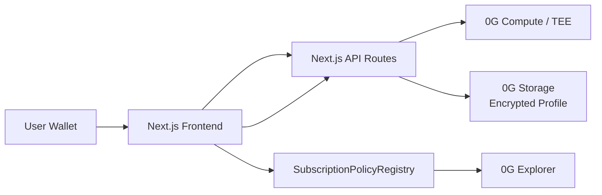

# SubGuardian

SubGuardian is a privacy-preserving AI subscription renewal firewall for AI and Web3 users.

It helps users analyze recurring AI tools, SaaS, API and Web3 infrastructure subscriptions, store encrypted subscription memory on 0G Storage, generate renewal recommendations through 0G Compute, and record user-authorized renewal decisions on 0G Chain.

> One-liner: **SubGuardian is a privacy-preserving AI agent for verifiable subscription renewal control.**

## Project Overview

Most subscription tools are trackers. SubGuardian is a **renewal firewall**: it asks whether a subscription should be renewed before the user or an AI agent keeps spending.

The MVP uses manual/mock subscription data, a user-defined renewal policy, AI-based renewal analysis, encrypted 0G Storage upload, and a Solidity registry that logs verifiable subscription decisions. It intentionally does not connect to banks, cards, payment rails, Netflix, Spotify, KYC, or real cancellation APIs.

## Problem

AI and Web3 users often subscribe to many recurring services:

- AI apps such as ChatGPT, Claude, Midjourney and Cursor
- SaaS tools such as Notion AI
- Web3 infrastructure such as RPC, indexers and storage
- API credits used by agents or prototypes

Users forget trials, lose visibility into monthly spend, and cannot prove why a renewal was allowed or blocked. Future AI agents will make this worse because agents may call paid APIs or renew services automatically.

## Solution

SubGuardian provides a user-side and agent-side renewal control layer:

- Import or manually enter subscriptions
- Set a renewal policy and monthly budget
- Ask an AI analyst to recommend `renew`, `pause`, `reject`, or `ask_user`
- Encrypt subscription memory before storage
- Store encrypted profile data on 0G Storage
- Record the analysis hash, storage root hash and user decision on 0G Chain

## Core Users

- AI tool power users
- Web3 developers
- Small teams and student teams
- AI agent users
- Web3 apps that need verifiable subscription authorization

## Why 0G

0G is useful for SubGuardian because the product needs decentralized storage, verifiable chain activity and AI execution infrastructure in one demo flow.

- **0G Chain** records user-authorized subscription decisions and emits Explorer-friendly events.
- **0G Storage** stores encrypted subscription memory and AI analysis results.
- **0G Compute / TEE** is the intended private inference layer for renewal recommendations.

## 0G Integration

### 0G Chain

The Solidity contract `SubscriptionPolicyRegistry` records:

- Subscription metadata
- 0G Storage root hash
- AI analysis hash
- Latest renewal decision

Events:

- `SubscriptionAdded`
- `AnalysisRecorded`
- `RenewalDecisionRecorded`
- `SubscriptionStorageUpdated`

After deploying to 0G Mainnet, set:

```bash
NEXT_PUBLIC_CONTRACT_ADDRESS=0xYourContract
```

The dashboard shows transaction hashes and Explorer links.

### 0G Storage

`lib/zeroG/storage.ts` encrypts the profile before upload using AES-256-GCM. The uploaded profile contains:

```json
{
  "user": "0x...",
  "subscriptions": [],
  "policy": {},
  "analysis": {},
  "createdAt": "...",
  "project": "SubGuardian"
}
```

When `ENABLE_MOCK_STORAGE=true`, the app returns a deterministic mock root hash. Keep this enabled on Vercel for the public demo unless you operate a dedicated server signer. Live server-paid uploads are wrapped behind the storage adapter and require `ZERO_G_STORAGE_SERVER_PRIVATE_KEY`; never use a user's MetaMask private key for this.

### 0G Compute / TEE

`lib/zeroG/compute.ts` contains the prompt and adapter for live 0G Compute calls. Live mode sends:

- Subscription list
- Renewal policy
- Wallet address
- `verify_tee: true`

Prompt:

```text
You are SubGuardian, a subscription renewal risk analyst for AI and Web3 users. Given a user's subscription list, usage score, next renewal date, monthly budget and renewal policy, return strict JSON. Recommend whether each subscription should be renewed, paused, rejected or manually confirmed. Consider usage score, budget pressure, price, category and renewal date. Do not include markdown. Return only valid JSON.
```

The expected response is strict JSON:

```json
{
  "overallRisk": "low",
  "monthlyTotal": 130,
  "budgetLimit": 100,
  "budgetStatus": "over_budget",
  "recommendations": [],
  "summary": "...",
  "nextActions": [],
  "teeVerified": true,
  "traceId": "..."
}
```

## Architecture



## Smart Contract

Contract: `contracts/SubscriptionPolicyRegistry.sol`

The contract is a registry and decision log only. It does not transfer funds, charge users, cancel subscriptions or implement payment logic.

Key functions:

- `addSubscription(...)`
- `recordAnalysis(uint256 subId, bytes32 analysisHash, string storageRootHash)`
- `recordDecision(uint256 subId, Decision decision)`
- `updatePolicyStorage(uint256 subId, string storageRootHash)`
- `getSubscription(uint256 subId)`
- `getUserSubscriptions(address user)`

Security model:

- Only the subscription owner can update analysis, storage hash or decision.
- No admin role.
- No token custody.

## Local Setup

```bash
npm install
cp .env.example .env.local
npm run dev
```

Open [http://localhost:3000](http://localhost:3000).

## Environment Variables

Public variables are exposed to the browser and must use the `NEXT_PUBLIC_` prefix. Server-only variables are read only by Next.js API Routes.

```bash
# Public browser variables
NEXT_PUBLIC_APP_NAME=SubGuardian
NEXT_PUBLIC_0G_CHAIN_ID=16661
NEXT_PUBLIC_0G_RPC_URL=https://evmrpc.0g.ai
NEXT_PUBLIC_0G_EXPLORER_URL=https://chainscan.0g.ai
NEXT_PUBLIC_CONTRACT_ADDRESS=

# Server-only variables for Next.js API Routes
ZERO_G_COMPUTE_API_KEY=
ZERO_G_COMPUTE_BASE_URL=
ZERO_G_STORAGE_RPC=https://evmrpc.0g.ai
ZERO_G_STORAGE_INDEXER=https://indexer-storage-turbo.0g.ai
ENABLE_MOCK_COMPUTE=true
ENABLE_MOCK_STORAGE=true

# Optional server-only settings
ZERO_G_COMPUTE_MODEL=llama-3.3-70b-instruct
SUBGUARDIAN_ENCRYPTION_SECRET=
```

Do not commit `.env`, `.env.local`, or `.env.production`. Do not add `PRIVATE_KEY` to Vercel. Frontend chain transactions are signed by the user through MetaMask, not by the Vercel backend.

For local contract deployment only, set `PRIVATE_KEY` in `.env.local` and run Hardhat locally. Do not upload the MetaMask Account 2 private key to Vercel.

## Deploy to Vercel

SubGuardian is a standard Next.js app, so Vercel can use the default Next.js build output. Vercel deploys only the frontend and Next.js API Routes; Solidity contracts are deployed separately with Hardhat.

1. Push project to GitHub.
2. Open Vercel Dashboard.
3. Continue with Google or GitHub.
4. Import GitHub repository.
5. Select the SubGuardian repository.
6. Framework Preset: Next.js.
7. Build Command: `npm run build`.
8. Output Directory: leave default.
9. Add Environment Variables.
10. Deploy.
11. After deployment, open the Vercel URL and test:
   - wallet connect
   - add 0G Mainnet
   - analyze subscriptions
   - upload encrypted profile
   - record decision on 0G Chain

If your GitHub repository root contains the `subguardian/` folder instead of the Next.js files directly, set Vercel **Root Directory** to `subguardian`.

### Vercel Environment Variables

Set these in Vercel Project Settings -> Environment Variables:

```bash
NEXT_PUBLIC_APP_NAME=SubGuardian
NEXT_PUBLIC_0G_CHAIN_ID=16661
NEXT_PUBLIC_0G_RPC_URL=https://evmrpc.0g.ai
NEXT_PUBLIC_0G_EXPLORER_URL=https://chainscan.0g.ai
NEXT_PUBLIC_CONTRACT_ADDRESS=0xYourDeployedContract

ZERO_G_COMPUTE_API_KEY=
ZERO_G_COMPUTE_BASE_URL=
ZERO_G_STORAGE_RPC=https://evmrpc.0g.ai
ZERO_G_STORAGE_INDEXER=https://indexer-storage-turbo.0g.ai
ENABLE_MOCK_COMPUTE=true
ENABLE_MOCK_STORAGE=true
```

For the hackathon demo, it is fine to leave the 0G Compute API key and base URL empty while `ENABLE_MOCK_COMPUTE=true`. Keep `ENABLE_MOCK_STORAGE=true` on Vercel unless you intentionally operate a dedicated server signer.

### Deployment Method A: Vercel Web

1. Push the code to GitHub.
2. In Vercel, click **Add New Project**.
3. Click **Import Git Repository**.
4. Select the GitHub repository.
5. Confirm **Framework Preset: Next.js**.
6. Set **Build Command** to `npm run build`.
7. Leave **Output Directory** empty/default.
8. Add the environment variables above.
9. Click **Deploy**.

### Deployment Method B: Vercel CLI

```bash
npm install -g vercel
vercel login
vercel
vercel --prod
```

The first `vercel` run asks you to choose a scope, link or create the project, confirm the project name, and confirm build settings. After the project is linked, use `vercel --prod` for production deployments.

## Deploy Contract to 0G

1. Fund the deployer wallet with 0G mainnet gas.
2. Set `.env.local`:

```bash
PRIVATE_KEY=your_deployer_private_key
NEXT_PUBLIC_0G_RPC_URL=https://evmrpc.0g.ai
NEXT_PUBLIC_0G_CHAIN_ID=16661
```

3. Compile and deploy:

```bash
npx hardhat compile
npm run deploy:0g
```

4. Copy the deployed address into:

```bash
NEXT_PUBLIC_CONTRACT_ADDRESS=0xDeployedAddress
```

5. Restart the dev server and run the dashboard flow. The 0G Chain panel will show transaction hashes and Explorer links.

## Demo Flow

1. Connect EVM wallet on 0G Mainnet.
2. Review mock subscriptions and policy.
3. Click **Analyze with 0G Compute**.
4. Click **Upload Encrypted Profile**.
5. Click **Add Subscription**.
6. Click **Record Analysis**.
7. Click **Record Decision**.
8. Open the 0G Explorer link and show emitted events.

Full 3-minute script: [`docs/demo-script.md`](docs/demo-script.md)

## Test Data

Default subscriptions:

| Service | Amount | Usage Score | Expected Direction |
| --- | ---: | ---: | --- |
| ChatGPT Plus | 20 USDT/month | 95 | renew |
| Midjourney | 30 USDT/month | 15 | pause |
| Cursor | 20 USDT/month | 90 | renew |
| Notion AI | 10 USDT/month | 45 | ask_user |
| Random AI API | 50 USDT/month | 20 | reject or pause |

Default policy:

- Monthly budget: 100 USDT
- Price increase limit: 15%
- Default action: ask_user
- Manual approval above: 30 USDT
- Auto-renew high usage services: true

## Commands

```bash
npm install
npm run dev
npx hardhat compile
npx hardhat test
npm run build
```

## Hackathon Submission Checklist

- [ ] Public GitHub repository
- [ ] Real 0G Mainnet contract address
- [ ] 0G Explorer link with visible transactions/events
- [x] 0G Chain contract integration
- [x] 0G Storage encrypted upload adapter
- [x] 0G Compute / TEE adapter with mock fallback
- [x] Next.js dashboard with wallet connection
- [x] README with architecture and reproducible setup
- [x] 3-minute demo script
- [ ] Demo video under 3 minutes

## X Post Template

```text
Introducing SubGuardian — a privacy-preserving AI subscription renewal firewall built on 0G.

SubGuardian helps AI & Web3 users analyze recurring subscriptions, store encrypted subscription memory on 0G Storage, use 0G Compute for private AI recommendations, and record renewal decisions on 0G Chain.

#0GHackathon #BuildOn0G
@0G_labs @0g_CN @0g_Eco @HackQuest_
```

## Roadmap

- CSV import and export
- Agent spending policy webhooks
- Team policy approvals
- Price increase detection
- Real 0G Compute TEE attestation display
- 0G Storage retrieval and user-side decryption
- Agent SDK for pre-renewal authorization
- Optional integration with wallets, Safe modules or account abstraction

## Notes for Judges

This MVP is intentionally scoped for an 8-day hackathon. It avoids regulated payment flows and focuses on the key 0G-native proof: encrypted subscription memory, AI recommendation, hash commitment and on-chain renewal decision records.
