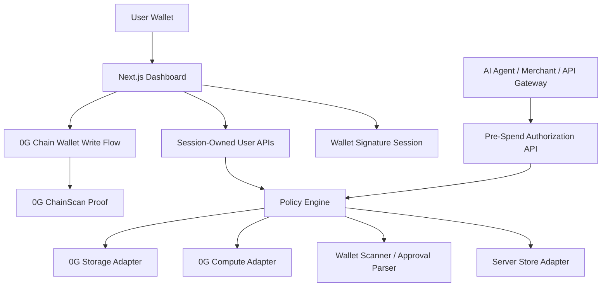

# SubGuardian

**AI Agent spending firewall before autonomous payments.**

SubGuardian is a non-custodial Web3 wallet autopay, subscription authorization, and AI Agent spending policy manager built for the **0G APAC Hackathon**. It lets a user connect a wallet, sign in with that wallet, configure spending rules, review recurring approvals, and force integrated AI agents or merchants to ask SubGuardian before spending.

The product is intentionally non-custodial: SubGuardian does **not** store user private keys, does **not** custody assets, and does **not** claim it can stop every transaction an EOA user signs directly. It provides pre-spend authorization for integrated agents/merchants today, plus an architecture path toward Safe/account-abstraction guards.

## Hackathon Fit

- **Hackathon:** 0G APAC Hackathon on HackQuest
- **Recommended track:** Agentic Economy & Autonomous Applications
- **Repository:** https://github.com/bjvgukv25842-cmyk/SubGuardian
- **One-liner:** AI Agent spending firewall before autonomous payments
- **Target users:** Web3 users, AI-agent operators, API gateways, SaaS merchants, and wallet security teams
- **Core 0G value:** verifiable spending decisions, encrypted decision memory, and AI-assisted risk analysis for autonomous economic activity

Autonomous agents increasingly spend through API keys, wallets, subscriptions, usage-based billing, and payment rails. SubGuardian adds the missing control point: before an agent pays, it checks budget, usage, approval risk, trusted/blocked services, and user policy, then returns `allow`, `pause`, `reject`, or `ask_user` with an auditable proof.

## What Judges Can Test

### User SaaS Flow

- `/` - product entry and wallet login screen
- `/dashboard` - wallet overview, policies, subscriptions, pending approvals, recent decisions, risk alerts, monthly spend, and audit records
- `/dashboard/policies` - wallet-owned spending policy persistence
- `/dashboard/wallet` - wallet scan and approval-risk view with honest fallback labeling
- `/dashboard/subscriptions` - detected recurring approval management
- `/dashboard/approvals` - user approval/rejection flow for `ask_user` spend requests
- `/dashboard/audit` - proof and optional 0G Chain record list
- `/proof/[id]` - verifiable decision receipt
- `/settings` - runtime live/mock mode status

### Developer / Integration Flow

- `/developers` - Developer Demo / API Simulator for pre-spend authorization
- `/developers/portal` - merchant/agent registration and hashed API key generation
- `POST /api/v1/spend/authorize` - merchant/agent pre-spend authorization API
- `GET /api/v1/spend/requests/[id]` - merchant polling endpoint for decision status
- `POST /api/v1/usage/events` - usage ledger endpoint for AI-agent activity

## 0G Integration Status

| 0G component | Current status | Evidence / implementation |
| --- | --- | --- |
| 0G Chain | **Live** | `SubscriptionPolicyRegistry` is deployed on 0G Mainnet with successful transactions and event logs. |
| 0G Storage | **Mock fallback in public demo, live adapter implemented** | `lib/zeroG/storage.ts` encrypts payloads and supports `@0glabs/0g-ts-sdk` upload when a dedicated server signer is configured. Mock roots are labeled `0g-mock-*`. |
| 0G Compute | **Mock fallback in public demo, live adapter implemented** | `lib/zeroG/compute.ts` supports live API calls and sends `verify_tee: true` when 0G Compute credentials are configured. Mock results are labeled `mode: "mock"`. |

The UI and API intentionally distinguish **Live 0G Chain**, **Mock Storage**, **Mock Compute**, **API proof**, and **user-signed chain transaction**. Mock services are never presented as live.

## Live 0G Chain Evidence

- **Contract:** `0xaC87E72e1aF91174EedaC91C08bF56768d6cE9fD`
- **Explorer:** https://chainscan.0g.ai/address/0xaC87E72e1aF91174EedaC91C08bF56768d6cE9fD
- **RPC used for verification:** `https://evmrpc.0g.ai`

Verified transactions:

| Transaction | Explorer | Status |
| --- | --- | --- |
| `0xdd0df16b1cc2261f0661930e604c26d6e21d8bb3fc7cbc4bf32bfb6b7f798dbc` | https://chainscan.0g.ai/tx/0xdd0df16b1cc2261f0661930e604c26d6e21d8bb3fc7cbc4bf32bfb6b7f798dbc | Success, receipt status `0x1`, one event log |
| `0x14e766169b6e63df9d2f3adb9ee252e3e7629f9485532a39e2101df2438a209e` | https://chainscan.0g.ai/tx/0x14e766169b6e63df9d2f3adb9ee252e3e7629f9485532a39e2101df2438a209e | Success, receipt status `0x1`, one event log |

The deployed contract supports subscription registration, analysis recording, decision recording, and policy storage hash updates. See `contracts/SubscriptionPolicyRegistry.sol` and `lib/zeroG/chain.ts`.

## Product Capabilities

- Wallet connection through injected EVM wallets such as MetaMask, Rabby, and OKX Wallet
- Sign-in with wallet signature and HttpOnly session creation
- Session-owned user APIs; user-owned data is derived from the session wallet, not trusted frontend `userWallet` fields
- Spending policy management: monthly budget, single-spend cap, daily/weekly/monthly limits, whitelist, blacklist, unknown-service default, manual approval threshold, agent policy, merchant policy, and emergency pause
- Wallet overview and approval-risk scanning for configured 0G/EVM RPC data with explicit fallback labeling
- Recurring spend/subscription detection from known approvals and wallet scan results
- Merchant/agent API key foundation with hashed key storage
- Idempotent spend authorization API for agents and merchants
- `ask_user` pending approval flow in the dashboard
- Proof page with decision hash, storage root, policy hash, mode, TEE status, signer wallet, tx hash, and Explorer links when available
- Live/mock health status through `/api/health` and `/settings`
- English/Chinese UI mode with consistent product content

## Architecture



Important files:

- `app/api/v1/spend/authorize/route.ts` - pre-spend authorization API
- `app/api/v1/spend/requests/[id]/route.ts` - decision polling
- `app/api/v1/usage/events/route.ts` - usage ledger events
- `app/api/auth/nonce/route.ts` and `app/api/auth/verify/route.ts` - wallet signature login
- `app/api/user/policy/route.ts` - session-owned policy API
- `app/api/user/wallet/scan/route.ts` - wallet scan endpoint
- `components/WalletConnect.tsx` - connect wallet and sign in
- `components/DashboardClient.tsx` - SaaS dashboard overview
- `components/PolicyDashboardClient.tsx` - policy management
- `components/ProofCredential.tsx` - proof receipt UI
- `lib/session.ts` - nonce/session verification
- `lib/policyEngine.ts` - deterministic spend authorization
- `lib/walletScanner.ts` - wallet data scanner and approval parser
- `lib/apiAuth.ts` - merchant/global API key auth
- `lib/serverStore.ts` - local store adapter with production database shape
- `lib/zeroG/chain.ts` - 0G Mainnet config, contract ABI, Explorer links
- `lib/zeroG/storage.ts` - encrypted 0G Storage adapter
- `lib/zeroG/compute.ts` - 0G Compute adapter with `verify_tee: true`

## Local Setup

```bash
npm install
cp .env.example .env.local
npm run dev
```

Open http://localhost:3000.

On Windows PowerShell, copy the environment file with:

```powershell
Copy-Item .env.example .env.local
npm run dev
```

## Environment Variables

Public browser variables:

```bash
NEXT_PUBLIC_APP_NAME=SubGuardian
NEXT_PUBLIC_0G_CHAIN_ID=16661
NEXT_PUBLIC_0G_RPC_URL=https://evmrpc.0g.ai
NEXT_PUBLIC_0G_EXPLORER_URL=https://chainscan.0g.ai
NEXT_PUBLIC_CONTRACT_ADDRESS=0xaC87E72e1aF91174EedaC91C08bF56768d6cE9fD
```

Server-only variables:

```bash
SUBGUARDIAN_API_KEY=
SUBGUARDIAN_DEMO_API_KEY=sg_demo_local
SUBGUARDIAN_ENCRYPTION_SECRET=
SUBGUARDIAN_STORE_FILE=tmp/subguardian-store.json
SUBGUARDIAN_DATABASE_URL=
SUBGUARDIAN_KNOWN_APPROVALS=

ZERO_G_COMPUTE_API_KEY=
ZERO_G_COMPUTE_BASE_URL=
ZERO_G_COMPUTE_MODEL=llama-3.3-70b-instruct
ENABLE_MOCK_COMPUTE=true

ZERO_G_STORAGE_RPC=https://evmrpc.0g.ai
ZERO_G_STORAGE_INDEXER=https://indexer-storage-turbo.0g.ai
ZERO_G_STORAGE_SERVER_PRIVATE_KEY=
ZERO_G_STORAGE_EXPECTED_REPLICA=1
ZERO_G_STORAGE_TASK_SIZE=10
ZERO_G_STORAGE_FEE=0
ENABLE_MOCK_STORAGE=true
```

Security rule: never commit `.env.local`, private keys, wallet seed phrases, `ZERO_G_COMPUTE_API_KEY`, or `ZERO_G_STORAGE_SERVER_PRIVATE_KEY`. For a public Vercel demo, keep `ENABLE_MOCK_COMPUTE=true` and `ENABLE_MOCK_STORAGE=true` unless live credentials and a dedicated server signer are intentionally configured.

## Demo Flow For Judges

1. Visit `/`.
2. Connect wallet.
3. Sign the SubGuardian login message. This creates a session only; it does not grant custody or transfer approval.
4. Open `/dashboard` and review wallet overview, active policies, detected subscriptions, pending approvals, risk alerts, spend summary, and audit records.
5. Open `/dashboard/policies`, change spending limits or trusted/blocked services, and save the policy.
6. Open `/dashboard/wallet` and run wallet scan. The UI labels whether data is real wallet data or limited fallback.
7. Open `/developers` and submit a pre-spend authorization request.
8. Open the returned proof URL and inspect `decisionId`, `analysisHash`, `storageRootHash`, `mode`, `chainTxHash`, signer wallet, and 0G links.
9. Open the 0G ChainScan contract and transaction links above to verify live 0G Chain evidence.
10. If the decision requires user approval, open `/dashboard/approvals` and approve or reject it.

## API Example

External agents and merchants call this before spending:

```http
POST /api/v1/spend/authorize
Authorization: Bearer <merchant-or-global-api-key>
Content-Type: application/json
```

```json
{
  "agentId": "research-agent",
  "merchantId": "mch_demo",
  "userWallet": "0x1111111111111111111111111111111111111111",
  "spender": "0x2222222222222222222222222222222222222222",
  "token": "0xTokenOrNative",
  "serviceName": "Midjourney",
  "category": "AI Tool",
  "amount": 30,
  "currency": "USDT",
  "billingCycle": "monthly",
  "reason": "Need image generation for a marketing campaign",
  "requestedAt": "2026-05-10T12:00:00.000Z",
  "idempotencyKey": "agent-run-123-midjourney-renewal"
}
```

Example response:

```json
{
  "decisionId": "dec_...",
  "decision": "pause",
  "riskScore": 82,
  "requiresUserApproval": true,
  "usageSignal": "low",
  "budgetStatus": "over_budget",
  "analysisHash": "0x...",
  "storageRootHash": "0g-mock-...",
  "chainTxHash": null,
  "proofUrl": "/proof/dec_...",
  "mode": "mock"
}
```

Supported decisions: `allow`, `pause`, `reject`, and `ask_user`.

`idempotencyKey` prevents duplicate authorization records during agent retries. `ask_user` creates a pending dashboard approval. The merchant should poll `GET /api/v1/spend/requests/[decisionId]` before proceeding.

The `/developers` page uses a built-in `sg_demo_local` token plus `X-SubGuardian-Demo: developers-page` so judges can run the API simulator without first creating a merchant account. Production integrations should use generated merchant API keys or a server-only `SUBGUARDIAN_API_KEY`.

## Build And Test

```bash
npm test
npm run build
```

Equivalent explicit commands:

```bash
node node_modules/hardhat/internal/cli/cli.js test
node test-policy-engine.cjs
node node_modules/next/dist/bin/next build
```

Latest local verification:

- Hardhat contract tests: passed, 3 tests
- Policy engine tests: passed, including idempotency, session wallet ownership, API key hashing, pending approval flow, mock/live labeling, and wallet approval parser
- Next.js production build: passed

## Vercel Deployment Notes

The app builds as a standard Next.js project. Recommended Vercel variables for the public hackathon demo:

```bash
NEXT_PUBLIC_APP_NAME=SubGuardian
NEXT_PUBLIC_0G_CHAIN_ID=16661
NEXT_PUBLIC_0G_RPC_URL=https://evmrpc.0g.ai
NEXT_PUBLIC_0G_EXPLORER_URL=https://chainscan.0g.ai
NEXT_PUBLIC_CONTRACT_ADDRESS=0xaC87E72e1aF91174EedaC91C08bF56768d6cE9fD
ENABLE_MOCK_COMPUTE=true
ENABLE_MOCK_STORAGE=true
SUBGUARDIAN_API_KEY=<server-only-demo-api-key>
SUBGUARDIAN_DEMO_API_KEY=sg_demo_local
SUBGUARDIAN_ENCRYPTION_SECRET=<server-only-random-secret>
```

Do not configure a user wallet private key in Vercel. If live 0G Storage is enabled later, use only a dedicated server signer with limited funds and keep it server-only.

The current `serverStore` is a local JSON-file adapter that mirrors the intended database schema. It is acceptable for local hackathon judging, but a production deployment should use Postgres/Supabase/Neon through the documented database adapter path.

## Security Model

- No user private key storage
- No custody of assets
- Wallet signatures create sessions only
- User-level APIs require session wallet ownership
- Merchant APIs use bearer keys; generated merchant keys are hashed before storage
- Nonce consumption protects login replay
- Idempotency protects spend authorization retries
- Proofs separate API decision creation from user-signed chain writes
- Mock Storage/Compute are labeled as mock and do not claim TEE verification
- EOA limitation is explicit: SubGuardian cannot stop direct transactions a user signs outside an integrated agent/merchant flow

See `docs/security-model.md` for the full security model.

## Known Limitations

- API `chainTxHash` can be `null` because the API creates a pre-spend proof before payment. Chain writes are completed by a user wallet flow, not by storing a backend user key.
- 0G Storage and 0G Compute are mock/fallback in the public submitted demo unless live credentials are configured.
- Wallet scanning has a working 0G/EVM RPC foundation and approval parser, but full historical indexing should be backed by an indexer in production.
- The local JSON store is not a production database.
- Webhook delivery workers, rate limiting, admin monitoring, and API key rotation/revocation UI are roadmap items.

## Submission Docs

- `docs/submission-evidence.md` - live 0G Chain evidence and verification notes
- `docs/hackathon-submission.md` - copy-ready HackQuest submission summary
- `docs/demo-script.md` - 3-minute demo script
- `docs/demo-checklist.md` - recording checklist
- `docs/product-roadmap.md` - staged roadmap from MVP to SaaS
- `docs/production-architecture.md` - production system architecture
- `docs/security-model.md` - non-custodial security and compliance boundaries
- `docs/user-guide.md` - user workflow guide
- `docs/api-integration-guide.md` - merchant/agent integration guide
- `docs/social-post.md` - X post draft

## Hackathon Checklist

- [x] GitHub repository prepared
- [x] README explains project, 0G integration, setup, tests, security, and limitations
- [x] Live 0G Chain contract address included
- [x] 0G ChainScan contract and transaction links included
- [x] Wallet login and session-owned dashboard implemented
- [x] Pre-spend authorization API implemented
- [x] Merchant API key foundation implemented
- [x] Policy engine and tests implemented
- [x] Proof page implemented
- [x] Mock/live mode labels implemented
- [x] English/Chinese UI mode implemented
- [ ] Demo video URL added after recording
- [ ] Public deployed app URL added after deployment
- [ ] X post URL added after publishing
