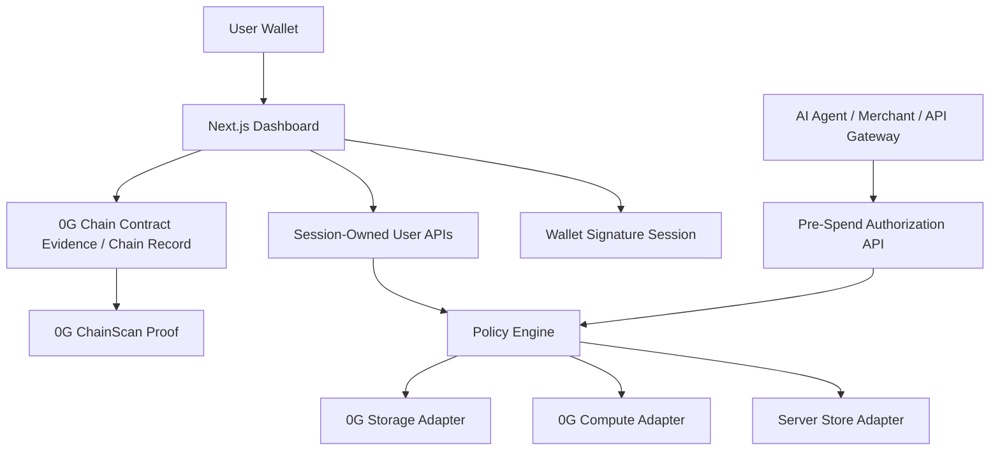

# SubGuardian

**SubGuardian is a non-custodial pre-spend approval and audit layer for Web3 subscriptions, wallet autopay, and AI Agent spending.**

**SubGuardian 是面向 Web3 订阅、钱包自动扣费和 AI Agent 支出的非托管花费前审批与审计层。**

SubGuardian helps Web3 users and AI Agent operators define spending policy before money moves.
It gives merchants, API gateways, and autonomous agents a pre-spend authorization API that returns `allow`, `pause`, `reject`, or `ask_user`.
Each decision includes policy output, risk scoring, hash-based proof metadata, and clear live/mock labeling.
The current hackathon MVP uses live 0G Chain evidence.
0G Storage and 0G Compute adapters are implemented, but they run as labeled mock/fallback in the public demo unless live credentials are configured.

SubGuardian is intentionally non-custodial:

- It does **not** store private keys.
- It does **not** custody user assets.
- It does **not** sign transactions for users.
- Wallet login is signed through the user's wallet.
- Current dashboard approval actions are bound to that wallet session.
- The current MVP records approval/audit proofs and does **not** process real payments.

## 1. Problem

Web3 users and AI Agents are starting to use more automatic subscriptions, API credits, compute credits, SaaS tools, DeFi bots, and agent services.
Traditional subscription management tools are designed for cards and centralized accounts.
They do not fit wallet-based spending, autonomous agents, API-key billing, or usage-based Web3 infrastructure.

AI Agents may spend through wallets, API keys, subscription approvals, and metered billing.
Users need a way to set budgets, whitelists, blacklists, single-spend limits, and human approval rules **before** a payment or renewal happens.
They also need an audit trail proving that a spend request passed through policy checks, risk analysis, and user approval.

Directly custodying assets or saving private keys would create the wrong security model.
SubGuardian uses a non-custodial design: it controls the authorization layer for integrated agents and merchants, while users keep control of their wallets.

## 2. Solution

SubGuardian adds a pre-spend approval layer between a user wallet and integrated merchants, API gateways, or AI Agents.

1. A user connects a wallet and signs in with a wallet signature.
2. The user creates a wallet-owned spending policy with monthly budget, single-spend cap, trusted services, blocked services, unknown-service behavior, manual approval threshold, and optional emergency pause.
3. A merchant, AI Agent, or API gateway calls `POST /api/v1/spend/authorize` before spending.
4. The policy engine checks budget, limits, whitelist, blacklist, usage signal, and approval thresholds.
5. The AI risk adapter can refine the result with `riskScore`, recommendation text, and `analysisHash`.
6. If the result requires human approval, the dashboard creates a pending `ask_user` request.
7. The user approves or rejects in the dashboard. SubGuardian updates the stored decision for merchant polling.
8. Proof metadata, analysis hashes, storage roots, and chain links are shown on `/proof/[id]` and `/dashboard/audit`.
9. Judges can verify live 0G Chain activity through the contract and transaction links below.

## 3. Hackathon Fit

| Item | Details |
| --- | --- |
| Hackathon | [0G APAC Hackathon](https://www.hackquest.io/zh-cn/hackathons/0G-APAC-Hackathon) |
| Recommended track | Track 3 — Agentic Economy & Autonomous Applications |
| Direction | Financial Rails / Operational Tools / Agentic Economy |
| Why this track | Automated billing, AI Agent spending, pre-spend approval, self-custodial wallet control, and verifiable audit trails |
| Target users | Web3 users, AI Agent operators, API gateways, SaaS merchants, wallet/security teams, and small teams using AI tools plus Web3 infrastructure |

Track 3 explicitly covers financial rails, automated billing, operational tools, and self-custodial agent wallets.
SubGuardian is built around that exact problem: autonomous software should ask for policy-based authorization before spending.

## 4. What Judges Can Test

Judges can test the product without real merchants by using the built-in developer simulator.

### User Dashboard Flow

- `/`: landing page and wallet login.
- `/dashboard`: wallet overview, policies, subscriptions, approvals, risk alerts, audit records, and recent decisions.
- `/dashboard/policies`: create and edit wallet-owned spending policy.
- `/dashboard/wallet`: wallet scan and approval risk view, with fallback data labeling.
- `/dashboard/subscriptions`: recurring approval / subscription candidate management.
- `/dashboard/approvals`: approve or reject pending `ask_user` spend requests.
- `/dashboard/audit`: proof and chain evidence list from stored decisions and chain records.
- `/proof/[id]`: verifiable decision receipt for a stored decision.
- `/settings`: mock/live status for 0G Chain, 0G Storage, 0G Compute, and API auth.

### Developer / Merchant / Agent Flow

- `/developers`: API simulator for pre-spend authorization.
- `/developers/portal`: merchant/agent registration and API key foundation.
- `POST /api/v1/spend/authorize`: merchant/agent pre-spend authorization API.
- `GET /api/v1/spend/requests/[id]`: merchant polling endpoint.
- `POST /api/v1/usage/events`: usage ledger endpoint.

## 5. MVP Scope

Current MVP demonstrates:

- Non-custodial wallet login.
- Wallet-owned spending policies.
- Pre-spend authorization API.
- Merchant/agent spend request simulation.
- Policy-based decision engine.
- AI risk analysis adapter.
- Encrypted storage adapter.
- User approval/rejection dashboard.
- Proof page.
- Live 0G Chain contract evidence.
- Mock/live mode labeling.

Current MVP does **not**:

- Process real payments.
- Custody user funds.
- Store private keys.
- Cancel real-world subscriptions.
- Connect to real bank accounts.
- Guarantee blocking direct EOA transactions signed outside SubGuardian.
- Replace Safe/account-abstraction guards yet.

Roadmap:

- Safe/account abstraction guard integration.
- Live merchant integrations.
- Production database.
- Live 0G Storage with dedicated server signer.
- Live 0G Compute credentials.
- API key rotation and revocation UI.
- Webhook workers.
- Rate limiting.
- Historical wallet indexer.

## 6. 0G Integration

| 0G Component | Status | How SubGuardian Uses It | Evidence |
| --- | --- | --- | --- |
| 0G Chain | **Live** | Deployed audit contract. Records subscription, analysis, decision, and storage-root events depending on the called function. | Contract `0xaC87...E9fD`; verified tx links in Section 7; `contracts/SubscriptionPolicyRegistry.sol`; `lib/zeroG/chain.ts`. |
| 0G Storage | **Mock fallback in public demo, live adapter implemented** | Encrypts decision/profile payloads with AES-256-GCM. Mock roots are labeled `0g-mock-*`. Live upload requires a dedicated server signer. | `lib/zeroG/storage.ts`; `.env.example`; do not claim live storage unless configured and tested. |
| 0G Compute | **Mock fallback in public demo, live adapter implemented** | Risk analysis adapter. Live requests include `verify_tee: true` when credentials are configured. Mock results do not claim TEE verification. | `lib/zeroG/compute.ts`; `.env.example`; `ENABLE_MOCK_COMPUTE=true` in public demo. |

### Why 0G Matters

0G Chain gives SubGuardian public verifiability for audit evidence.
0G Storage fits encrypted decision/proof memory, where users and agents need persistent records without exposing raw sensitive data.
0G Compute fits AI risk analysis for autonomous agent spending, especially when secure execution and verifiable inference are needed.

The 0G stack is a strong fit for AI x Web3 applications that need scale, persistence, verifiability, and secure execution across autonomous economic workflows.

## 7. Live 0G Chain Evidence

| Evidence | Link | What it proves |
| --- | --- | --- |
| Contract | [0xaC87E72e1aF91174EedaC91C08bF56768d6cE9fD](https://chainscan.0g.ai/address/0xaC87E72e1aF91174EedaC91C08bF56768d6cE9fD) | `SubscriptionPolicyRegistry` is deployed on 0G Mainnet. |
| Tx 1 | [0xdd0df16b1cc2261f0661930e604c26d6e21d8bb3fc7cbc4bf32bfb6b7f798dbc](https://chainscan.0g.ai/tx/0xdd0df16b1cc2261f0661930e604c26d6e21d8bb3fc7cbc4bf32bfb6b7f798dbc) | Successful transaction to the SubGuardian contract, receipt status `0x1`, one event log, block `32657250`. |
| Tx 2 | [0x14e766169b6e63df9d2f3adb9ee252e3e7629f9485532a39e2101df2438a209e](https://chainscan.0g.ai/tx/0x14e766169b6e63df9d2f3adb9ee252e3e7629f9485532a39e2101df2438a209e) | Successful transaction to the SubGuardian contract, receipt status `0x1`, one event log, block `32740660`. |

Verification details:

- RPC used for verification: `https://evmrpc.0g.ai`
- Contract file: `contracts/SubscriptionPolicyRegistry.sol`
- 0G config and ABI file: `lib/zeroG/chain.ts`
- Explorer/proof UI file: `components/ProofCredential.tsx`
- Chain record API for user-submitted transaction links: `app/api/user/chain-records/route.ts`
- Evidence doc: `docs/submission-evidence.md`

The deployed contract supports `addSubscription`, `recordAnalysis`, `recordDecision`, `updatePolicyStorage`, and read helpers.
API `chainTxHash` can be `null` because the API generates a pre-spend proof before payment.
Chain evidence is recorded through user-authorized wallet/transaction flows or submitted chain record metadata, not by storing a backend user key.

Current code boundary:

- `lib/zeroG/chain.ts` defines the 0G Mainnet config, ABI, contract address, and Explorer helpers.
- `components/ProofCredential.tsx` displays contract and transaction proof links.
- `app/api/user/chain-records/route.ts` stores user-submitted transaction links for audit records.
- The current frontend does not expose an active `writeContract` caller for judges to trigger directly from a page.
- The live ChainScan links above are the authoritative 0G Chain evidence for this MVP submission.

## 8. Product Capabilities

### Wallet & Session

- EVM wallet connection through injected wallets such as MetaMask, Rabby, and OKX Wallet.
- Wallet signature login.
- HttpOnly session cookie.
- Short-lived signed login challenges with signature verification.
- No private key storage.

### Spending Policy

- Monthly budget.
- Single spend cap.
- Daily, weekly, and monthly limits.
- Trusted services whitelist.
- Blocked services blacklist.
- Manual approval threshold.
- Unknown service default action.
- Emergency pause.
- Agent and merchant policy maps in the data model.

### Pre-Spend Authorization

- Merchant/agent API.
- Bearer auth via global API key, demo key, or hashed merchant API key.
- `idempotencyKey` for retry-safe authorization.
- Decisions: `allow`, `pause`, `reject`, `ask_user`.
- Pending approval dashboard for `ask_user`.
- Merchant polling endpoint.
- Usage ledger endpoint for future decision quality.

### AI Risk & Proof

- Risk score.
- Recommendation / reason.
- Analysis hash.
- Policy hash.
- Storage root hash.
- Proof page.
- TEE status label.
- Explorer links when a chain transaction hash is available.

### Wallet Risk View

- Native balance read through configured 0G/EVM RPC.
- Known approval parser through `SUBGUARDIAN_KNOWN_APPROVALS`.
- Approval risk labels, including unlimited approval detection.
- Subscription candidate detection from approvals.
- Clear `real_wallet_data` / `limited_rpc_fallback` / `simulated_demo_data` labeling.

Known limitation: the current wallet scanner is not a full historical indexer. Production should add an indexed approval and transaction history service.

## 9. Architecture



Module explanation:

- `Next.js Dashboard`: user-facing wallet login, policy, approvals, audit, and proof pages.
- `Wallet Signature Session`: SIWE-style message flow using nonce, wallet signature, and HttpOnly session.
- `Session-Owned User APIs`: user data is derived from the authenticated wallet session.
- `Pre-Spend Authorization API`: merchant/agent API called before a spend.
- `Policy Engine`: deterministic budget, whitelist, blacklist, limit, and approval decision logic.
- `Server Store Adapter`: local JSON/memory persistence with a production database-shaped interface.
- `0G Compute Adapter`: live-or-mock risk analysis adapter.
- `0G Storage Adapter`: encrypted proof/decision payload adapter.
- `0G Chain`: deployed contract and ChainScan evidence for verifiable audit records.

## 10. Key Files

| File | Purpose |
| --- | --- |
| `app/api/v1/spend/authorize/route.ts` | Main merchant/agent pre-spend authorization API. |
| `app/api/v1/spend/requests/[id]/route.ts` | Merchant polling endpoint for decision status. |
| `app/api/v1/usage/events/route.ts` | Usage ledger endpoint. |
| `app/api/v1/decisions/[id]/route.ts` | Decision detail API for session owner or authenticated integration. |
| `app/api/auth/nonce/route.ts` | Creates wallet login nonce and message. |
| `app/api/auth/verify/route.ts` | Verifies wallet signature and creates session. |
| `app/api/auth/session/route.ts` | Reads or clears current session. |
| `app/api/user/policy/route.ts` | Session-owned policy read/update API. |
| `app/api/user/wallet/scan/route.ts` | Wallet scan endpoint. |
| `app/api/user/approvals/[id]/route.ts` | User approve/reject endpoint for pending requests. |
| `app/api/user/chain-records/route.ts` | Stores user-submitted chain tx evidence links. |
| `app/api/dashboard/summary/route.ts` | Dashboard summary aggregation. |
| `app/api/merchants/route.ts` | Merchant/agent registration foundation. |
| `app/api/merchants/[id]/api-keys/route.ts` | Hashed merchant API key creation/listing. |
| `components/WalletConnect.tsx` | Connect wallet and sign in. |
| `components/DashboardClient.tsx` | Main dashboard overview. |
| `components/PolicyDashboardClient.tsx` | Policy management UI. |
| `components/ListPagesClient.tsx` | Wallet, subscriptions, approvals, and audit list pages. |
| `components/ProofCredential.tsx` | Proof receipt UI. |
| `components/SettingsClient.tsx` | Runtime live/mock status UI. |
| `lib/session.ts` | Nonce, signature verification, session cookie helpers. |
| `lib/policyEngine.ts` | Deterministic spend authorization engine. |
| `lib/walletScanner.ts` | Wallet scan and approval parser. |
| `lib/apiAuth.ts` | Global/demo/merchant API key auth and hashing. |
| `lib/serverStore.ts` | Local store adapter and persistence interface. |
| `lib/zeroG/chain.ts` | 0G Mainnet config, contract ABI, Explorer link helpers. |
| `lib/zeroG/storage.ts` | Encrypted 0G Storage adapter with mock fallback. |
| `lib/zeroG/compute.ts` | 0G Compute adapter with `verify_tee: true` in live mode. |
| `lib/zeroG/decisionLog.ts` | Authorization mode and decision snapshot persistence helper. |
| `contracts/SubscriptionPolicyRegistry.sol` | 0G Chain contract. |
| `scripts/deploy.ts` | Hardhat deploy script for 0G Mainnet. |
| `test/SubscriptionPolicyRegistry.test.ts` | Contract tests. |
| `test-policy-engine.cjs` | Policy engine and integration behavior tests. |

## 11. API Example

External agents and merchants call this endpoint before spending:

```http
POST /api/v1/spend/authorize
Authorization: Bearer <merchant-or-global-api-key>
Content-Type: application/json
```

Request example:

```json
{
  "agentId": "research-agent",
  "merchantId": "mch_demo",
  "userWallet": "0x1111111111111111111111111111111111111111",
  "spender": "0x2222222222222222222222222222222222222222",
  "token": "0xTokenOrNative",
  "serviceName": "Midjourney",
  "category": "AI Tool",
  "amount": 30,
  "currency": "USDT",
  "billingCycle": "monthly",
  "reason": "Need image generation for a marketing campaign",
  "requestedAt": "2026-05-10T12:00:00.000Z",
  "idempotencyKey": "agent-run-123-midjourney-renewal"
}
```

Response example:

```json
{
  "decisionId": "dec_...",
  "decision": "pause",
  "riskScore": 82,
  "requiresUserApproval": true,
  "usageSignal": "low",
  "budgetStatus": "over_budget",
  "analysisHash": "0x...",
  "storageRootHash": "0g-mock-...",
  "policyHash": "0x...",
  "teeVerified": false,
  "chainTxHash": null,
  "proofUrl": "/proof/dec_...",
  "createdAt": "2026-05-10T12:00:00.000Z",
  "mode": "mock",
  "status": "pending_user_approval"
}
```

Decision meanings:

- `allow`: merchant may proceed under current policy.
- `pause`: merchant should hold the spend and wait for policy, usage, or user review changes.
- `reject`: merchant must not proceed unless the user changes policy and submits a new request.
- `ask_user`: merchant must wait for dashboard approval or rejection.

`idempotencyKey` prevents duplicate authorization records during retries. If the decision is `ask_user`, SubGuardian creates a pending dashboard approval. The merchant should poll:

```http
GET /api/v1/spend/requests/[decisionId]
Authorization: Bearer <merchant-or-global-api-key>
```

The `/developers` page includes a built-in demo token for judging, so judges can try the simulator without setting up a merchant account.
Production integrations should use generated merchant API keys from `/developers/portal` or a server-only `SUBGUARDIAN_API_KEY`.

## 12. Local Setup

```bash
npm install
cp .env.example .env.local
npm run dev
```

Open:

```text
http://localhost:3000
```

Windows PowerShell equivalent:

```powershell
Copy-Item .env.example .env.local
npm run dev
```

## 13. Environment Variables

Public browser variables:

```bash
NEXT_PUBLIC_APP_NAME=SubGuardian
NEXT_PUBLIC_0G_CHAIN_ID=16661
NEXT_PUBLIC_0G_RPC_URL=https://evmrpc.0g.ai
NEXT_PUBLIC_0G_EXPLORER_URL=https://chainscan.0g.ai
NEXT_PUBLIC_CONTRACT_ADDRESS=0xaC87E72e1aF91174EedaC91C08bF56768d6cE9fD
```

Server-only variables:

```bash
SUBGUARDIAN_API_KEY=
SUBGUARDIAN_DEMO_API_KEY=sg_demo_local
SUBGUARDIAN_SESSION_SECRET=
SUBGUARDIAN_ENCRYPTION_SECRET=
SUBGUARDIAN_STORE_FILE=tmp/subguardian-store.json
SUBGUARDIAN_DATABASE_URL=
SUBGUARDIAN_KNOWN_APPROVALS=

ZERO_G_COMPUTE_API_KEY=
ZERO_G_COMPUTE_BASE_URL=
ZERO_G_COMPUTE_MODEL=llama-3.3-70b-instruct
ENABLE_MOCK_COMPUTE=true

ZERO_G_STORAGE_RPC=https://evmrpc.0g.ai
ZERO_G_STORAGE_INDEXER=https://indexer-storage-turbo.0g.ai
ZERO_G_STORAGE_SERVER_PRIVATE_KEY=
ZERO_G_STORAGE_EXPECTED_REPLICA=1
ZERO_G_STORAGE_TASK_SIZE=10
ZERO_G_STORAGE_FEE=0
ENABLE_MOCK_STORAGE=true
```

Security rule: never commit `.env.local`, private keys, wallet seed phrases, `ZERO_G_COMPUTE_API_KEY`, or `ZERO_G_STORAGE_SERVER_PRIVATE_KEY`.
For a public Vercel demo, keep `ENABLE_MOCK_COMPUTE=true` and `ENABLE_MOCK_STORAGE=true` unless live credentials and a dedicated server signer are intentionally configured.

## 14. Build, Test, and Deploy

Run tests:

```bash
npm test
```

Run production build:

```bash
npm run build
```

Explicit command fallback:

```bash
node node_modules/hardhat/internal/cli/cli.js test
node test-policy-engine.cjs
node node_modules/next/dist/bin/next build
```

Deploy contract to 0G Mainnet:

```bash
npm run deploy:0g
```

Deploying requires `.env.local` with:

```bash
PRIVATE_KEY=<dedicated-deployer-private-key>
NEXT_PUBLIC_0G_RPC_URL=https://evmrpc.0g.ai
NEXT_PUBLIC_0G_CHAIN_ID=16661
```

Do not use a user's wallet private key for server-side storage or deployment automation.

Vercel deployment notes:

- Build command: `npm run build`
- Framework: Next.js
- Set the public `NEXT_PUBLIC_*` variables above.
- Set `SUBGUARDIAN_SESSION_SECRET` and `SUBGUARDIAN_ENCRYPTION_SECRET`.
- Keep Storage/Compute mock flags enabled unless live credentials are configured.
- The current store is a local JSON-file adapter; production should use a real database.

## 15. How Judges Can Verify 0G Chain Evidence

1. Open the contract: [0xaC87E72e1aF91174EedaC91C08bF56768d6cE9fD](https://chainscan.0g.ai/address/0xaC87E72e1aF91174EedaC91C08bF56768d6cE9fD).
2. Open Tx 1: [0xdd0df16b1cc2261f0661930e604c26d6e21d8bb3fc7cbc4bf32bfb6b7f798dbc](https://chainscan.0g.ai/tx/0xdd0df16b1cc2261f0661930e604c26d6e21d8bb3fc7cbc4bf32bfb6b7f798dbc).
3. Open Tx 2: [0x14e766169b6e63df9d2f3adb9ee252e3e7629f9485532a39e2101df2438a209e](https://chainscan.0g.ai/tx/0x14e766169b6e63df9d2f3adb9ee252e3e7629f9485532a39e2101df2438a209e).
4. Confirm each transaction goes to `0xaC87E72e1aF91174EedaC91C08bF56768d6cE9fD`.
5. Confirm each receipt is successful and includes an event log.
6. Compare the contract interface with `contracts/SubscriptionPolicyRegistry.sol` and `lib/zeroG/chain.ts`.

Equivalent RPC verification:

```bash
curl https://evmrpc.0g.ai \
  -H "Content-Type: application/json" \
  -d '{"jsonrpc":"2.0","id":1,"method":"eth_getTransactionReceipt","params":["0xdd0df16b1cc2261f0661930e604c26d6e21d8bb3fc7cbc4bf32bfb6b7f798dbc"]}'
```

Expected result includes:

```json
{
  "to": "0xac87e72e1af91174eedac91c08bf56768d6ce9fd",
  "status": "0x1"
}
```

## 16. Security Model

- SubGuardian does not save user private keys.
- SubGuardian does not custody assets.
- Wallet signatures create sessions only.
- User-level APIs require the session wallet.
- Merchant APIs use bearer keys; generated merchant keys are hashed before storage.
- Login challenges are signed, wallet-bound, and short-lived.
- `idempotencyKey` prevents duplicate authorization decisions during retries.
- Mock Storage/Compute are labeled as mock and do not claim TEE verification.
- EOA limitation is explicit: SubGuardian cannot stop direct transactions a user signs outside an integrated agent/merchant flow.

Full security notes:

- `docs/security-model.md`

## 17. Submission Docs

| File | Purpose |
| --- | --- |
| `docs/submission-evidence.md` | Live 0G Chain evidence and verification notes. |
| `docs/hackathon-submission.md` | Copy-ready HackQuest submission summary. |
| `docs/demo-script.md` | 3-minute demo script. |
| `docs/demo-checklist.md` | Recording checklist. |
| `docs/product-roadmap.md` | MVP-to-production roadmap. |
| `docs/production-architecture.md` | Production architecture notes. |
| `docs/security-model.md` | Non-custodial security and compliance boundaries. |
| `docs/user-guide.md` | User workflow guide. |
| `docs/api-integration-guide.md` | Merchant/agent integration guide. |
| `docs/social-post.md` | X post draft. |
